# 🚀 BR30 Market Scanner

Professional Real-Time Market Scanner built for Traders, Investors, and Market Analysts.

BR30 Market Scanner provides live market data, momentum scanning, OI analysis, volume tracking, gainers/losers detection, TradingView integration, and multi-market monitoring from a single dashboard.

---

# 🌐 Live Demo

Frontend:
https://br30marketscanner-com-frontade.vercel.app

Backend:
https://br30marketscanner-com-backend.onrender.com

---

# 📸 Screenshots

## Login Page

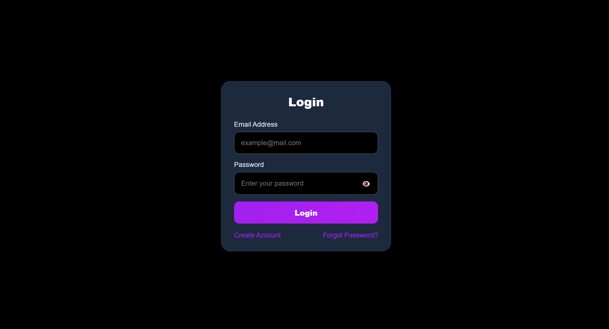

## Register Page

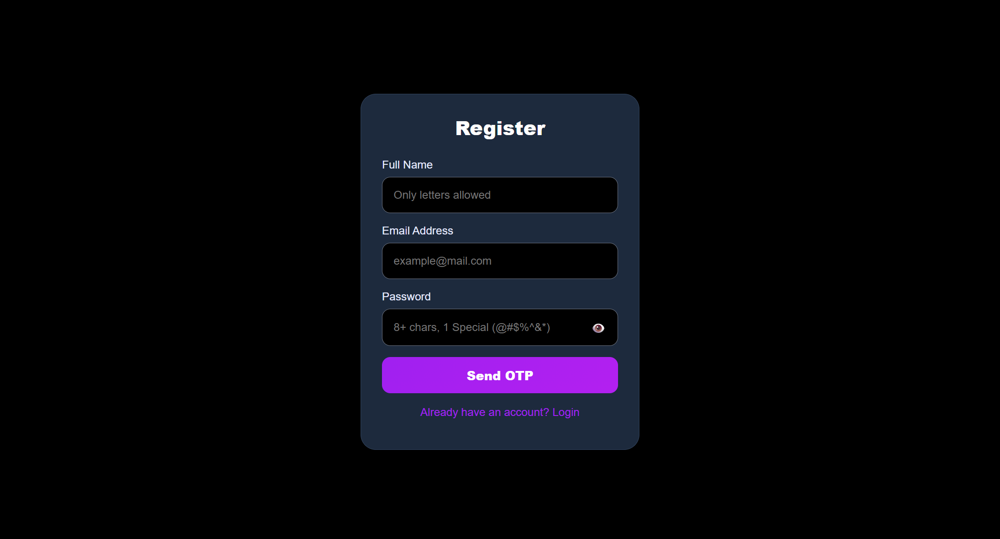

## Forgot Password

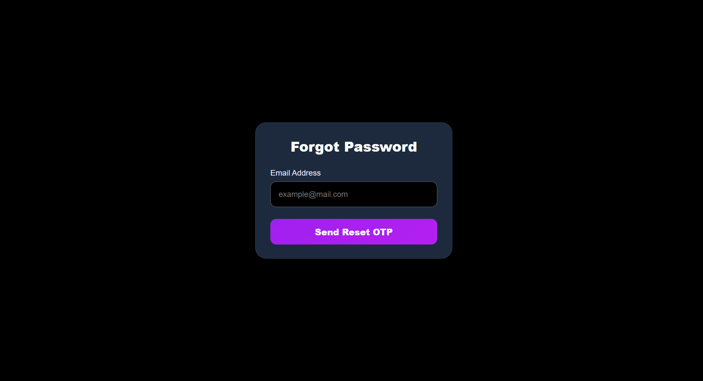

---

## Equity Stock Scanner

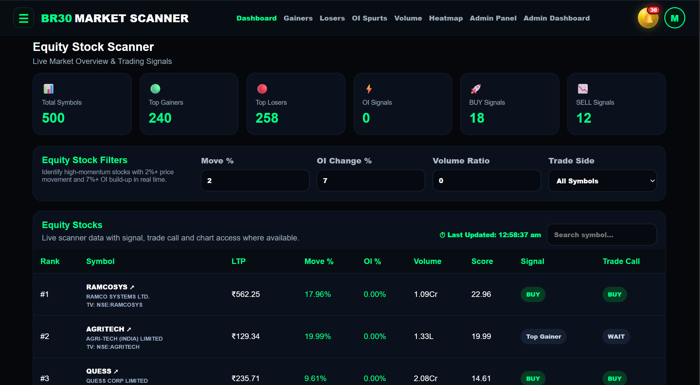

## Equity Stock Option Scanner

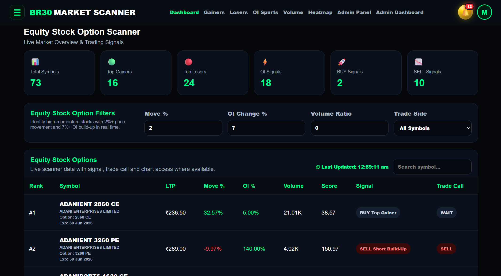

## Future Stock Scanner

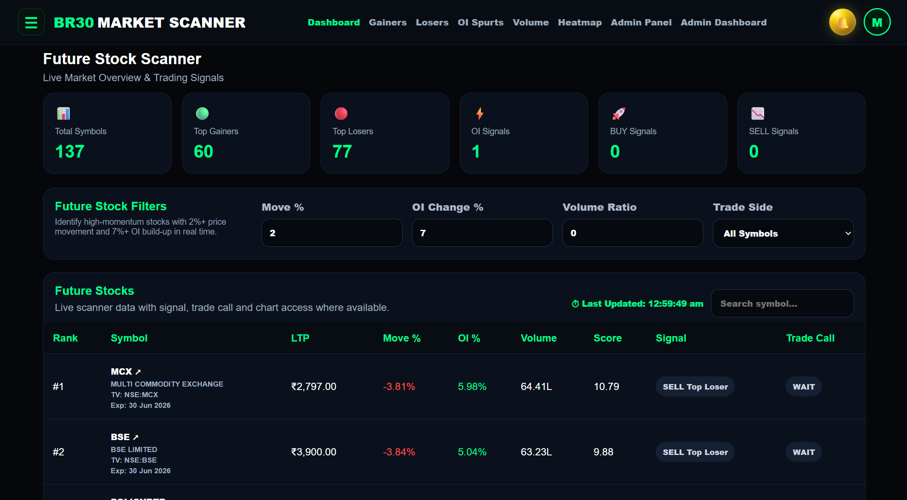

## Future Stock Option Scanner

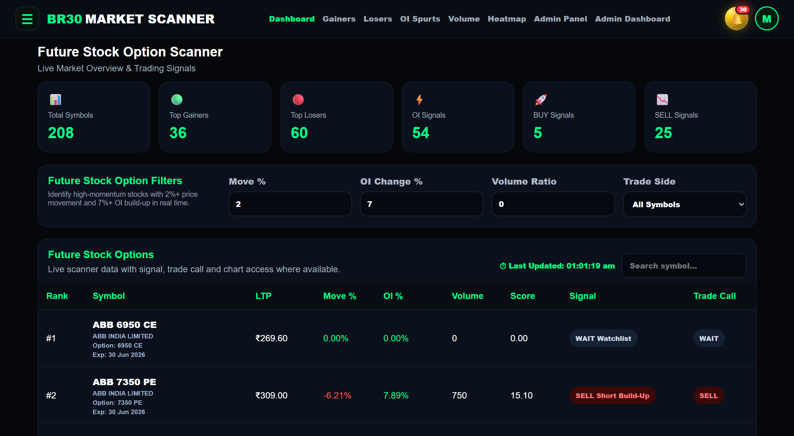

## Index Future Scanner

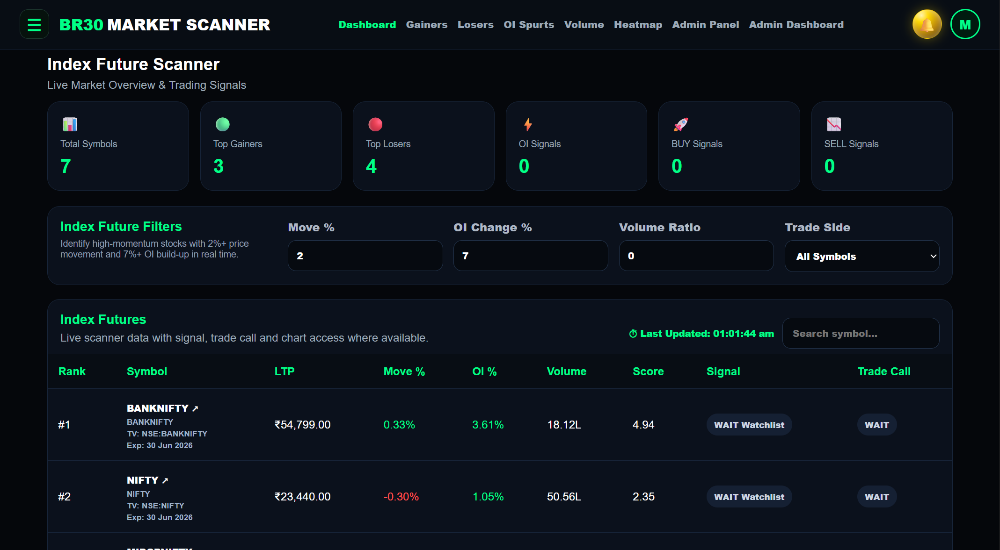

## Index Option Scanner

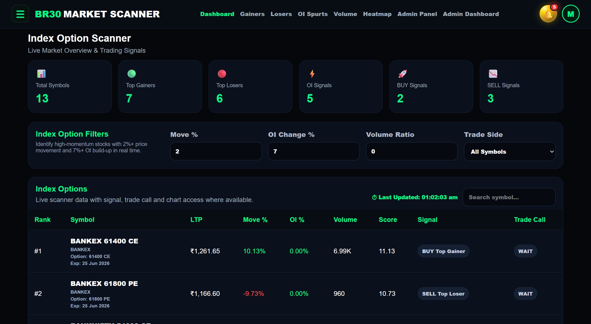

## Market Heatmap

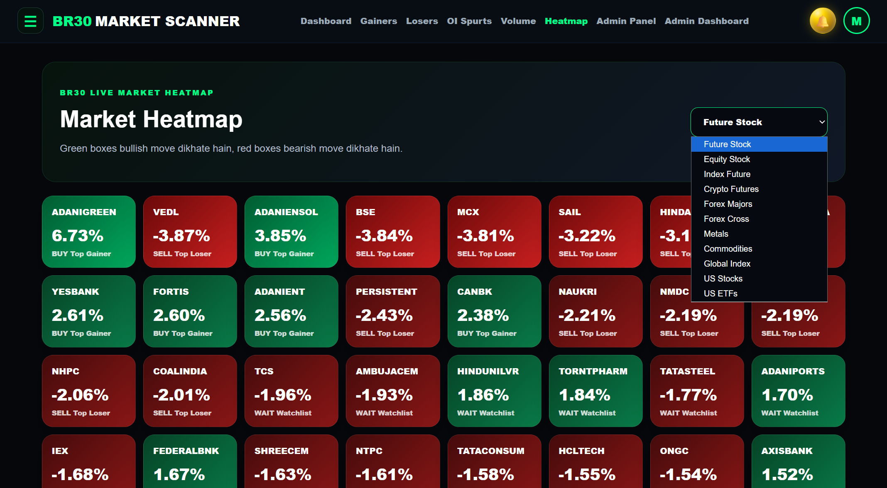

---

## User Subscription Tracker

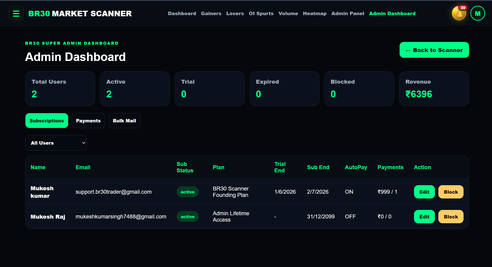

## User Management

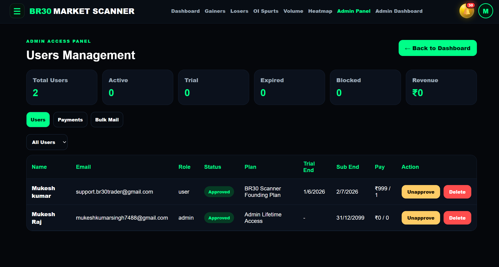

## Payment Tracker

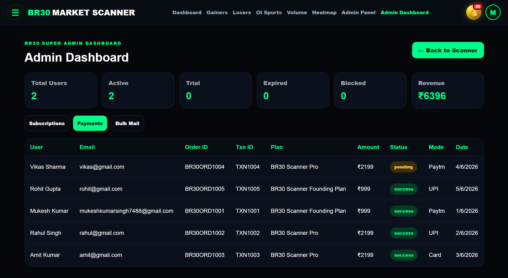

## Bulk Mail Marketing

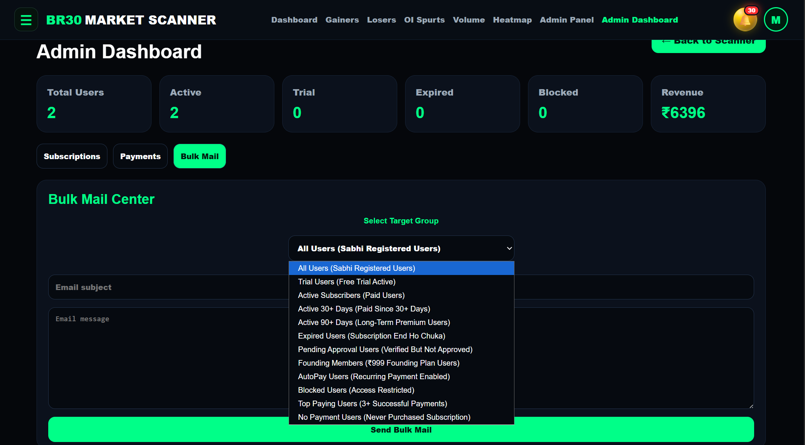

---

## Alert Notification Bell

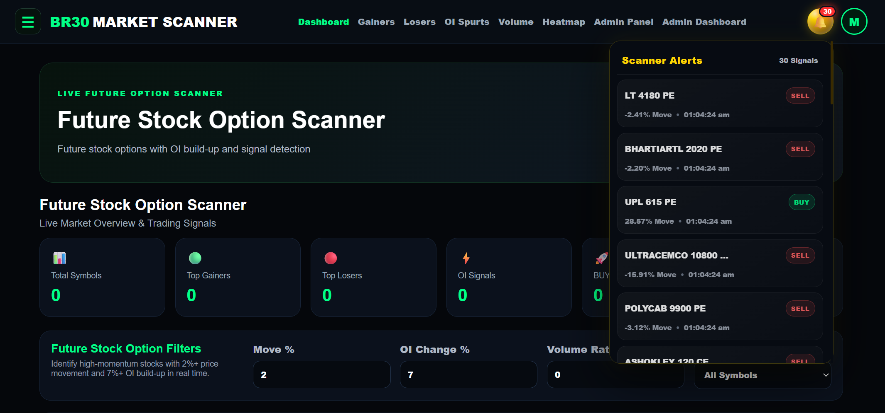

## User Profile Menu

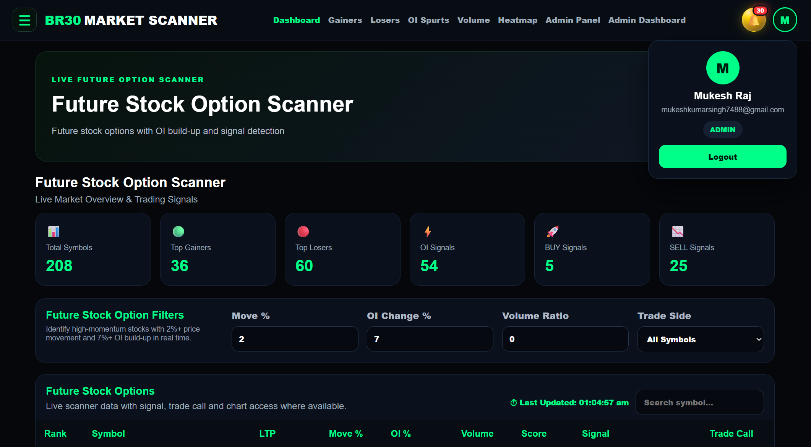

---

# ✨ Features

## 📈 Equity Stock Scanner

- Real-Time Equity Data
- Top Gainers Detection
- Top Losers Detection
- High Volume Detection
- Momentum Tracking
- Trade Signal Generation
- TradingView Integration

---

## 🎯 Equity Stock Option Scanner

- CE / PE Tracking
- OI Change Analysis
- Volume Analysis
- Premium Movement Detection
- Smart Signal Detection
- Option Activity Monitoring

---

## 📊 Future Stock Scanner

- Futures Price Tracking
- OI Build-Up Detection
- Long Build-Up Signals
- Short Build-Up Signals
- Volume Expansion Analysis

---

## 🚀 Future Stock Option Scanner

- Future Option Activity
- Premium Tracking
- OI Analysis
- Smart Signal Detection
- Trend Monitoring

---

## 📉 Index Future Scanner

Supported Indices:

- NIFTY
- BANKNIFTY
- FINNIFTY
- MIDCPNIFTY
- NIFTYNXT50
- SENSEX
- BANKEX

Features:

- Live Futures Data
- OI Monitoring
- Momentum Analysis
- Volume Analysis

---

## 🎯 Index Option Scanner

Supported Indices:

- NIFTY
- BANKNIFTY
- FINNIFTY
- MIDCPNIFTY
- NIFTYNXT50
- SENSEX
- BANKEX

Features:

- CE & PE Monitoring
- OI Analysis
- Premium Tracking
- Smart Trade Signals

---

## 🔥 OI Spurts Scanner

Detects:

- Long Build-Up
- Short Build-Up
- Long Unwinding
- Short Covering

---

## 📊 Volume Scanner

Detects:

- Unusual Volume Activity
- High Participation Stocks
- Momentum Stocks
- Institutional Activity

---

## 🟩 Market Heatmap

Visual Market Overview

- Sector Strength
- Market Direction
- Momentum Zones
- Relative Strength

---

## 📈 TradingView Integration

Features:

- One Click Chart Open
- Direct Symbol Navigation
- Real-Time Chart Analysis

---

# 🏗️ Tech Stack

## Frontend

- React.js
- Vite
- Axios
- React Router DOM
- CSS3

## Backend

- Node.js
- Express.js
- MongoDB
- Axios

## APIs

- Upstox Market Data API
- Upstox Instrument Master

## Deployment

- Vercel (Frontend)
- Render (Backend)
- MongoDB Atlas

---

# 📁 Project Structure

```bash
br30marketscanner-com-frontade
│
├── images/
│
├── public/
│
├── src/
│   │
│   ├── components/
│   │   ├── Navbar.jsx
│   │   ├── ScannerTable.jsx
│   │   ├── StatCards.jsx
│   │   ├── Filters.jsx
│   │
│   ├── pages/
│   │   ├── Dashboard.jsx
│   │   ├── Gainers.jsx
│   │   ├── Losers.jsx
│   │   ├── OISpurts.jsx
│   │   ├── Volume.jsx
│   │   ├── Heatmap.jsx
│   │
│   ├── services/
│   │   ├── api.js
│   │
│   ├── utils/
│   │
│   ├── App.jsx
│   ├── main.jsx
│
├── index.html
├── package.json
├── vite.config.js
├── vercel.json
└── README.md
```

---

# 📡 Supported Markets

| Market               | Status |
| -------------------- | ------ |
| Equity Stocks        | ✅     |
| Equity Stock Options | ✅     |
| Stock Futures        | ✅     |
| Future Stock Options | ✅     |
| Index Futures        | ✅     |
| Index Options        | ✅     |

---

# 🔐 Security Features

- Environment Variables Protection
- API Access Control
- Token Based Authentication
- Secure Backend Architecture

---

# ⚡ Performance Features

- Instrument Master Caching
- Optimized API Calls
- Fast Refresh
- Smart Filtering
- Low Latency Dashboard

---

# 🎯 Target Users

- Intraday Traders
- Option Buyers
- Option Sellers
- Swing Traders
- Scalpers
- Market Analysts
- Investors

---

# 👨‍💻 Developed By

Mukesh Raj

Founder — BR30 Group

🌐 BR30 Ecosystem

- BR30 Trader
- BR30 Kart
- BR30 Algo
- BR30 Founder
- BR30 Market Scanner

---

# 📬 Contact

Email:
br30service.contact@gmail.com

LinkedIn:
https://www.linkedin.com/in/mukesh-raj-b75a65253

GitHub:
https://github.com/mukeshkumarsingh7488-afk

---

# ⭐ Support

If you like this project, don't forget to give it a Star ⭐

---

© 2026 BR30 Group. All Rights Reserved.
